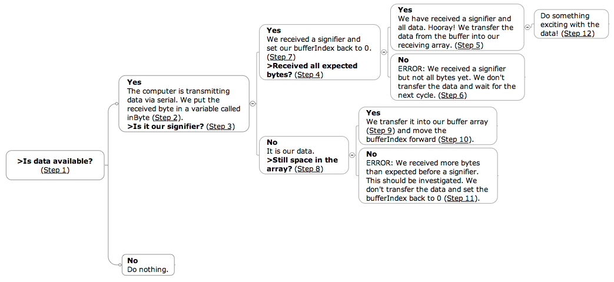

# Sending data from oF to Arduino

This tutorial illustrates how you can send data from an openFrameworks application to the Arduino via a USB port, using **ofSerial**. This way you can use any data input (mouse, keyboard, a database, the internet) and control Arduino output (servo motors, LEDs, etc.).

### Concept
Data via serial is sent in a stream of bytes in each updating cycle. Apart from the information we want to send, we also have to include a signifier at the end of each updating cycle, for the Arduino to distinguish a set of data from the next. This is especially important when we intend to send several data inputs individually packed in bytes (for example the X and Y coordinates of the mouse cursor).

The Arduino then receives one byte after each other and puts them in a buffer. As soon as it receives the signifier, it knows all the data of this updating cycle has been received. It sends the data from the buffer to an array, from where it can be put to use.
   

### Steps

*in openFrameworks*

1. **Setup** serial communication
2. **Define data** from any input (key, mouse, an image) into the a variable the size of a byte.
3. **Send data** via serial connection to the Arduino
4. **Send signifier** to distinguish each updating cycle

*in Arduino*

1. **Setup** serial communication
2. **Receive data** and put it into an array

***

## openFrameworks

### 1. Setup

First we need to create an instance of the `ofSerial` class, in the **.h** file of your openFrameworks program. Let's call it `serial`:

*ofApp.h*

	#pragma once
	#include "ofMain.h"

	class ofApp: public ofBaseApp
	{
	public:
    	void setup();
    	void update();
    	void draw();

    	ofSerial serial; 		// our ofSerial instance		
	}

In our **.cpp** file we then initialize our instance. For this we need the Serial port (USB port to which the Arduino is connected) and the Baud rate. Both have to *correspond with the Arduino*. 

The **Serial port** address will be different for every computer, so check in your Arduino program under *Tools > Serial Port* . It looks something like this: `/dev/tty.usbmodem411`.

The **baud rate** is the speed (pulses per second )with which your program and the Arduino talk to each other. In order for them to understand the data being sent and received, they need to be the same in your program and the Arduino setup. Usually `9600` is sufficient.

In addition, we limit the **frame rate** of the oF application's update cycle to 30 frames per second. This can be adjusted for each application, but it should not be higher than needed, as this will unnecessarily strain the computer running the program, and the Arduino might not be able to catch up with the stream of data.

*ofApp.cpp*
	
	void testApp::setup()
	{			
		ofSetFrameRate(30);							// setting frame rate to 30fps
        serial.setup("/dev/tty.usbmodem411",9600);	// initializing port and baud rate
   	}

### 2. Define data

The reading and sending of the data will all happen in the `update()` function of our **.cpp** file.

The data that we want to send to the Arduino has to be read into an `unsigned char` (the size of a byte). For this we need to make sure that the data we read into it is a number between 0-254 (a byte takes numbers from 0-255, but we will need the number 255 as a signifier, see below). To scale any number into a number between 0 and 254, we use the **ofMap** function. It takes in a value that for example goes from 0 to 1080 (the screen width) and scales it down to a value that goes from 0 to 254 (a byte).

`float ofMap(value, inputMin, inputMax, outputMin, outputMax, bool clamp)`

**Value** defines where we take the data from, and the boolean **clamp** assures that the data will never be out of our byte-range when it is set to `true`. If we for example want to send the X and Y position of our mouse cursor to the Arduino (using `oGetMouseX()` and `ofGetMouseY()`), it would look like this:

*ofApp.cpp* in the `update()` function:

	unsigned char scaledMouseX = ofMap(ofGetMouseX(), 0, ofGetWidth(), 0, 254, true);
	unsigned char scaledMouseX = ofMap(ofGetMouseX(), 0, ofGetWidth(), 0, 254, true);

### 3. Send data

Still in the `update()` function of our **.cpp** file, we now take the byte-sized variables called `scaledMouseX` and `scaledMouseY` and send it via our serial connection.

*ofApp.cpp* in the `update()` function:

	serial.writeByte(scaledMouseX);
    serial.writeByte(scaledMouseY);

### 4. Send signifier

We are sending the data of the mouse positions in numbers ranging 0-254 in two bytes. This means we can send a third byte with the number 255, as a signal to the Arduino that both coordinates have been sent.

*ofApp.cpp* in the `update()` function:

	serial.writeByte(255);

### Run the program
Run the program. It will now send the position of the mouse in the program's window with a frame rate of 30fps via USB serial connection to the Arduino. Now let's make sure someone is listening at the other end.

***

## Arduino

### 1. Setup

On the Arduino side, we need to define a few variables to start with:

*Arduino IDE*

	// The signifier-byte that marks the end of an updating cycle
	const byte PACKET_BOUNDARY_BYTE = 255; 

	// The amount of bytes we are expecting from the oF application 
	// (X and Y positions in this case)
	const int NUM_BYTES_EXPECTED = 2;
	
Next we need a buffer array that can store the received data for each cycle. Once this is filled, the data can be sent on. We also need a variable that tells us where in the array we are currently writing data (a cursor, if you will). We'll call it `bufferIndex`. Finally, an array called `dataValues[]` where we can send the data from our buffer when it is received.

*Arduino IDE*

	byte buffer[NUM_BYTES_EXPECTED] = { 0, 0 }; 
	byte bufferIndex = 0;
	byte dataValues[NUM_BYTES_EXPECTED] = { 0, 0 };

In our `setup()` we need to initialize our serial communication with the same baud rate (`9600`) that we sent in our openFrameworks application.

*Arduino IDE*

	void setup()
	{  
  		Serial.begin(9600);
	}

### 2. Receive data

In the `loop()` we are then checking for the incoming data with a series of convoluted `while`- and `if`-loops. When we have successfully received the data and placed it inside our array, we can then access and use it (also in our `loop()`-function).

*Receiving data scheme:*

*Arduino IDE*

	void loop()
	{  		
  		while(Serial.available() > 0) 								// Step 1	
  		{    		
    		byte inByte = Serial.read();							// Step 2
    	
    		if(inByte == PACKET_BOUNDARY_BYTE)						// Step 3
    		{    			
      			if(bufferIndex == NUM_BYTES_EXPECTED)				// Step 4
      			{
      					for(int i = 0; i < NUM_BYTES_EXPECTED; ++i)	// Step 5
        				{
            				dataValues[i] = buffer[i];
        				}      
      			} 
      			else 
      			{
        		// do nothing										// Step 6
	 			}
      			bufferIndex = 0;									// Step 7
    		} 
    		else
			{
      			if(bufferIndex < NUM_BYTES_EXPECTED)				// Step 8
      			{
        			buffer[bufferIndex] = inByte;					// Step 9
        			bufferIndex++;									// Step 10
      			}
      			else
      			{
        		bufferIndex = 0;									// Step 11
      			}
    	} // end of serial communication
    	
    	// Put the data from the dataValues[] array to use!			// Step 12
    	
  	}
